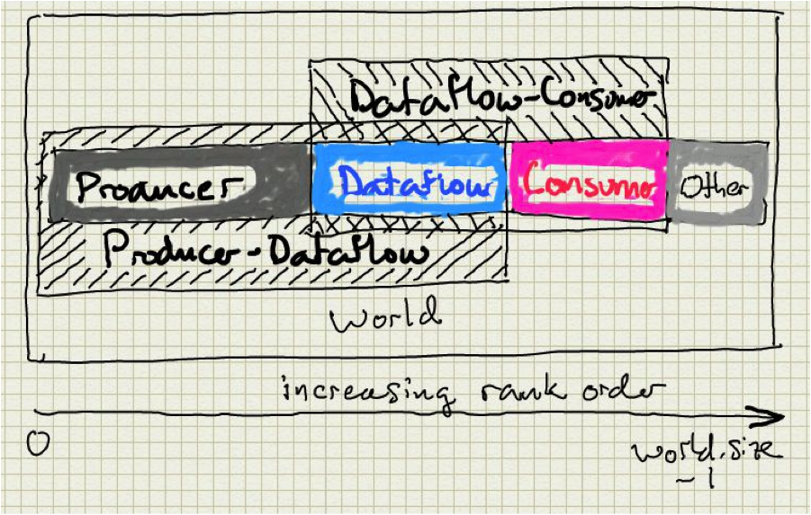

# Communicators

The communicator object is an abstraction for transport layer (for
example, MPI) communicators. A communicator can be created either by
its type or by a continuous range of ranks. The size and rank within a
communicator can be queried anytime. Starting with the world
communicator provided by the user, decaf creates 5 communicators as
shown in Figure . In addition to
one communicator each for the producer, dataflow, and consumer
respectively, decaf creates two more communicators that overlap the
producer with dataflow, and dataflow with consumer, respectively.

See decaf/comm.hpp.
